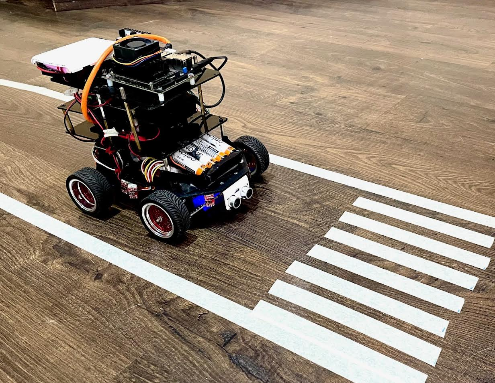

# Technova Line Follower & Crosswalk Spotter

Welcome to **Technova**, a line-following robot that can detect crosswalks! Built on a **Jetson Nano** with an **OAK-D camera**, this robot follows lines on the ground and stops or moves carefully when it spots a crosswalk. It communicates with a **Raspberry Pi 4** via UDP to control motors. The code is written in Python, packed with image processing, PID control, and a dash of personality! 

 
*Technova in action, cruising and spotting crosswalks!*

## Features
- **Line Following**: Uses Hough Transform and PID control to follow lines smoothly.
- **Crosswalk Detection**: Spots 7-14 stripes using perspective transform and contour detection.
- **Real-Time Control**: Stops for 5 seconds at crosswalks, then moves for 5-10 seconds.
- **Tunable Parameters**: Adjust Canny, Hough, and crosswalk settings via sliders.
- **Fun Vibes**: Playful logs like "Yesss, crosswalk :)" and "NOOO" keep it human.

## Hardware Requirements
- **Jetson Nano** (4GB recommended)
- **OAK-D Camera** (for image processing)
- **Raspberry Pi 4** (for motor control)
- A robot chassis with motors and a servo
- Crosswalk-like striped pattern for testing

## Software Requirements
- Python 3.8+
- Libraries:
  ```bash
  pip install opencv-python numpy depthai msgpack
